# SGL Listas

Projeto feito para a conclusão do curso Médio Técnico no CEFET-RJ. Posteriormente foi conectado com um aplicativo através do Firebase por outro aluno da instituição.

### Uso da plataforma

O Site Gerador de Listas ou SGL Listas, é um projeto com a intenção de ajudar professores a elaborar e guardar suas listas de exercício ou provas. Ele possui um banco de questões que é alimentado pelos próprios professores e que pode ser reaproveitado por outros professores. 

O site conta com 2 tipos diferentes de acesso, o de professor e de administrador.

 * Professor

   ​	O professor tem a possibilidade de criar listas, enviar questões e sugerir disciplinas pra entrar no site.

   

* Administrador 

  ​	O administrador, além de todas as opções do professor, pode aprovar questões criadas para que elas sejam vistas por todos os professores, aprovar as disciplinas que foram sugeridas e tornar usuários administradores.

### Telas da Aplicação

#### Acessos - Todos os Usuários

Para ter acesso ao sistema o usuário teve possuir um login, ele pode se cadastrar ao descer na página de login.

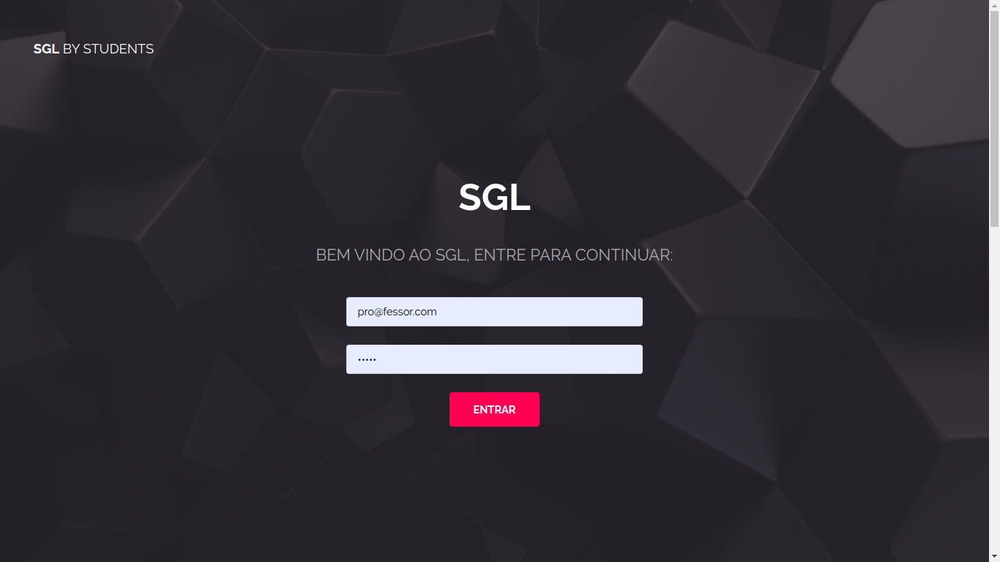

Possuindo o acesso, quando o usuário não é um administrador ele vai se deparar com a seguinte tela.

Já se ele possuir uma conta administradora se deparará com a seguinte tela.

#### Funcionalidades

Qualquer nível de usuário pode sugirir uma disciplina na tela inicial.

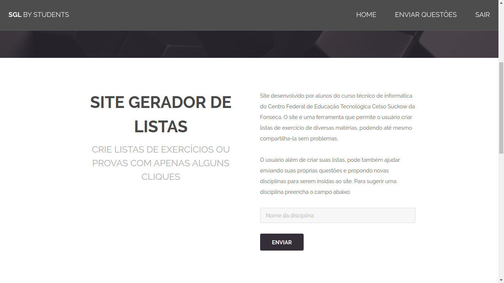

Além disso, ainda na página inicial é possível ver todas as listas que foram criadas.

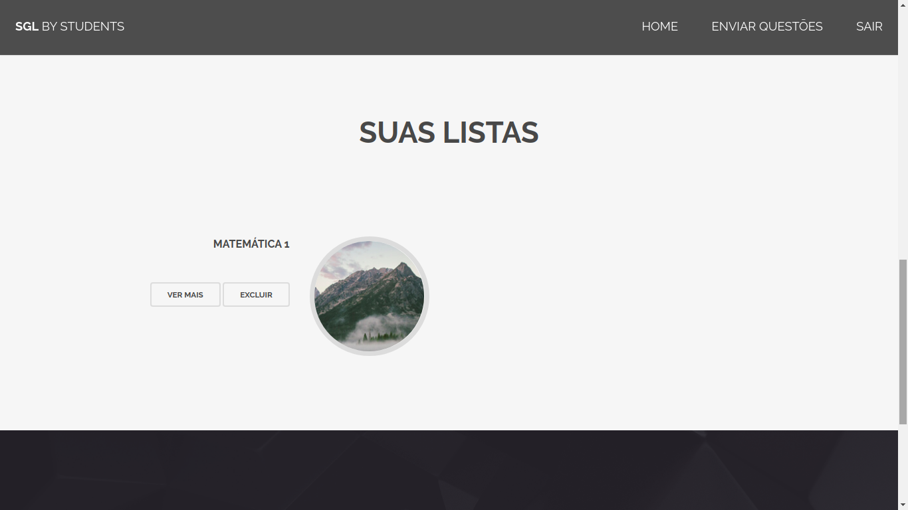

Para criar uma lista, o usuário deve dizer o nome e a disciplina a qual ela está relacionada.

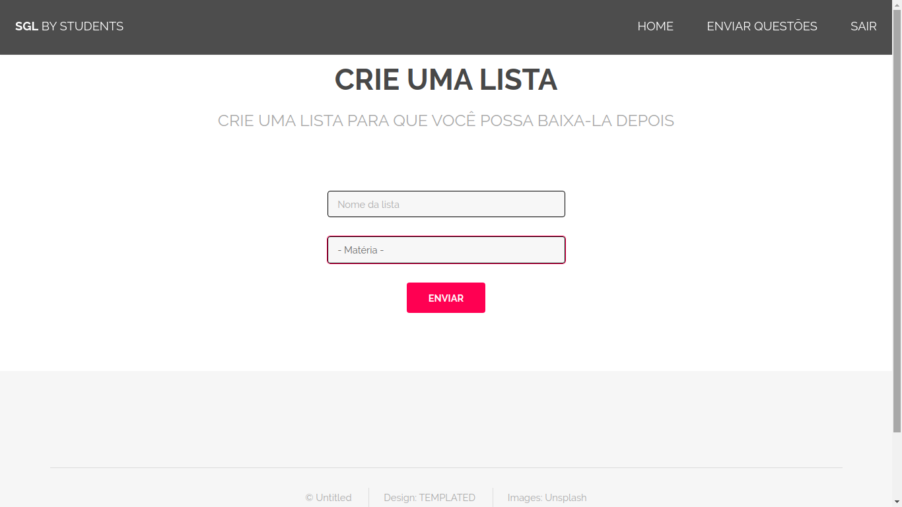

Após essa etapa o sistema irá mostrar todas as questões disponíveis dessa disciplina, as que são públicas e as que o usuário publicou.

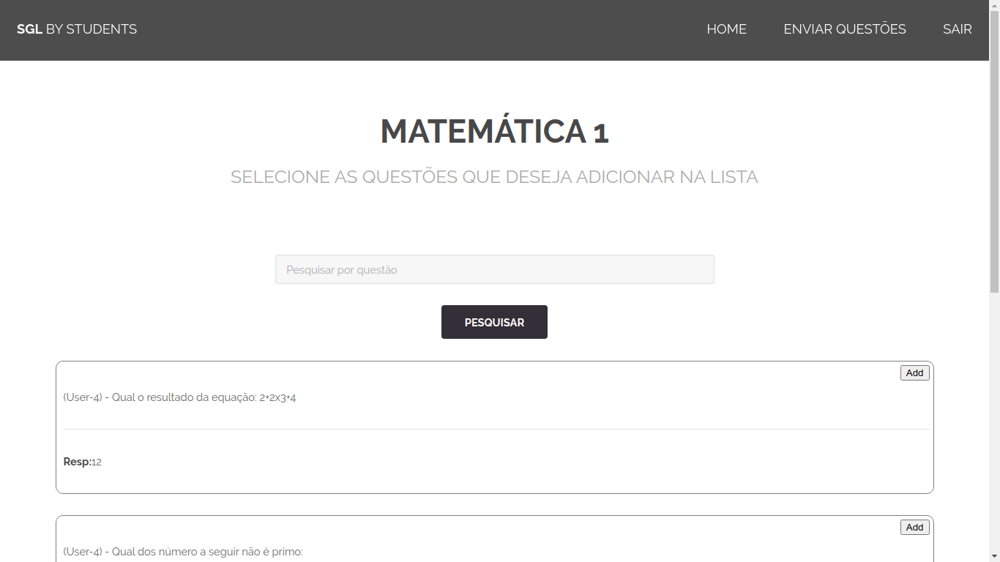

A lista criada, podemos ve-la na página inicial. Entrando em ver mais podemos fazer alterações na nossas listas e baixar tanto a lista quando o gabarito.

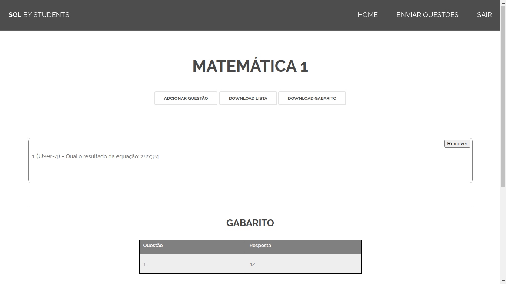

Os usuários podem, além de escolher as questões que estão no banco de questões, enviar as próprias questões ou de terceiros (dando os devidos creditos). Nessa parte o usuário deve escolher qual o tipo de questão ele quer enviar, ele tem as opções de:

- Discursiva
- Objetiva Texto
- Objetiva Imagens

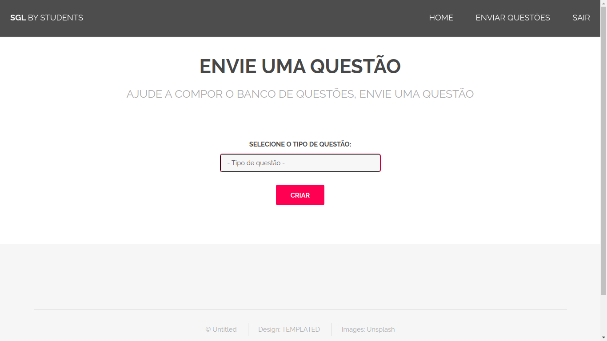

Selecionado o tipo de questão um formulário adaptado para cada uma sera aberto.

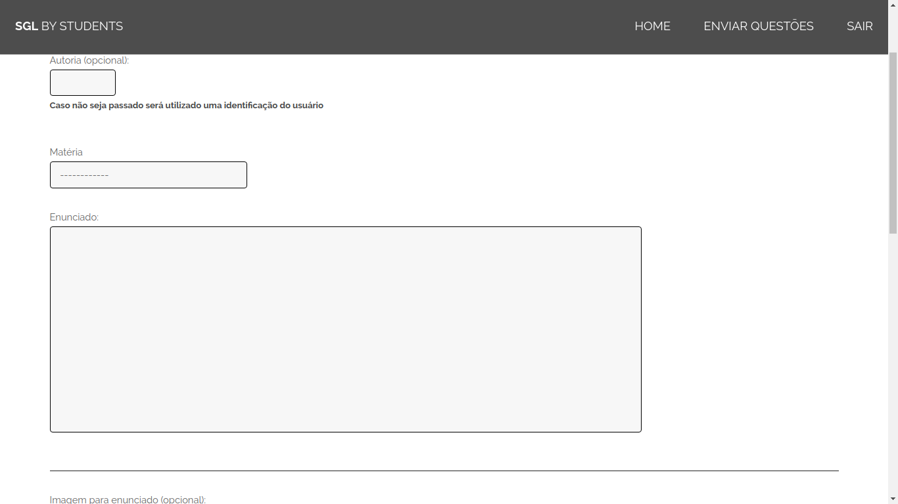

#### Acessos - Administradores

Um administrador pode aprovar questões enviadas por professores, para que possa ser vista por todos e não só por ele.

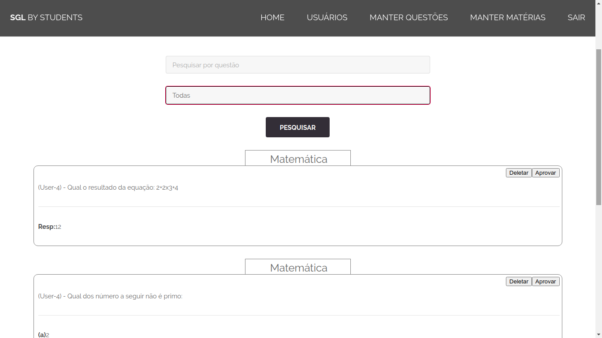

O admistrador também é responsável por aprovar disciplinas sugeridas

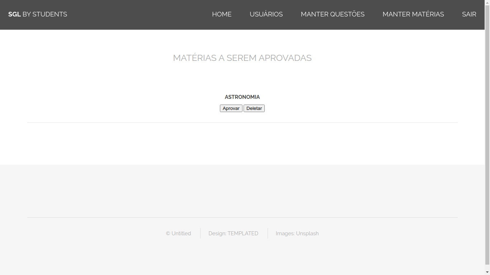

E por criar outros administradores (excluir conta utilizado apenas para fase de testes)

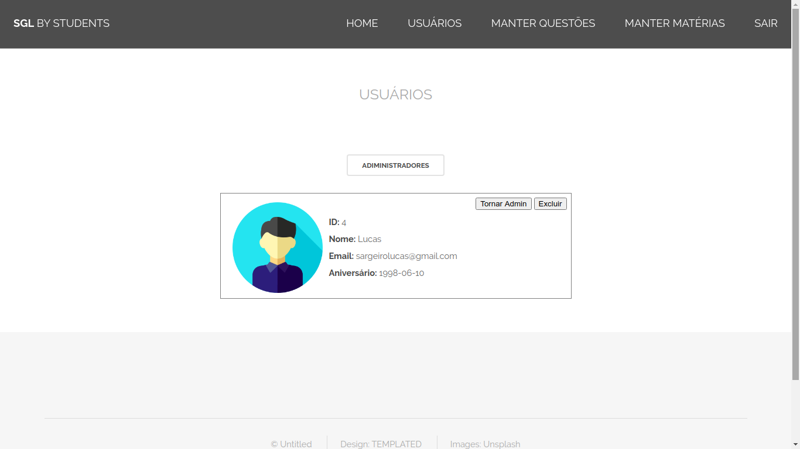

### Modificações futuras

Futuramente novas funcionalidades serão adicionadas, além de bugs consertados e consultas otimizadas.
